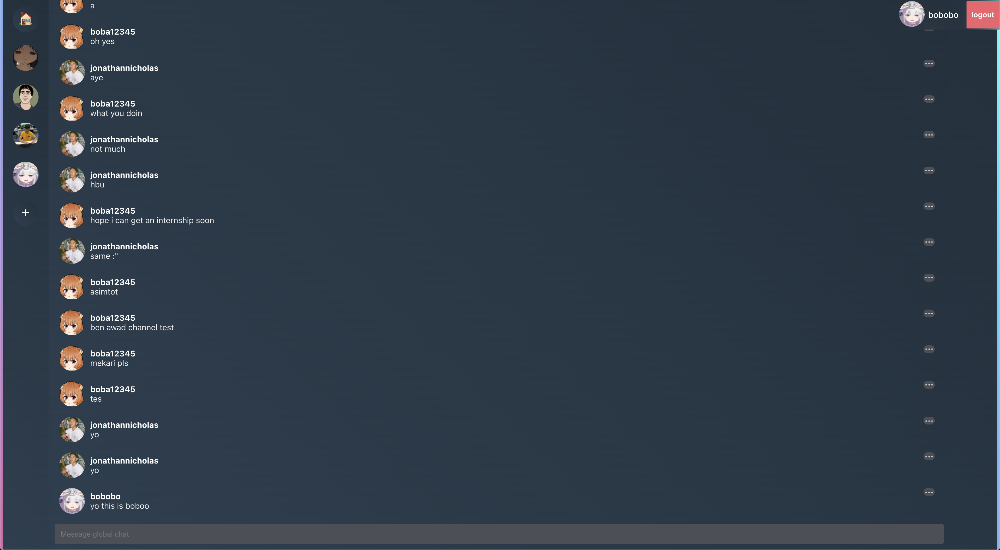

[Frontend](https://github.com/jojonicho/distro) - [Backend](https://github.com/jojonicho/node-graphql-jwt-auth)

# Distro! A Discord Clone.

A discord clone built with NextJS, Typescript, and ApolloGraphQL.


**Discord Clone with NextJS, Typescript, and Apollo GraphQL**<br>

- Chat implementation using Apollo GraphQL Subscriptions.
- Typescript and styled with Emotion.js.
- Apollo Codegen for type-safety mutation/query/subcription hooks.
- User register validation, login and authentication using refresh and authentication Json Web Token.
- User confirmation with email using Nodemailer stored in Redis.
- Backend using Node with TypeORM and TypeGraphQL.

## Installation

Tierlist requires NextJS to run.

```sh
git clone https://github.com/jojonicho/distro.git
cd distro
yarn
yarn start
```
